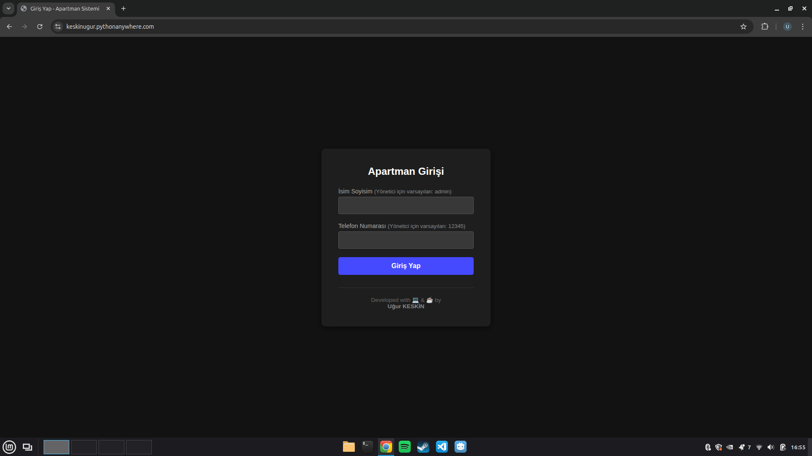
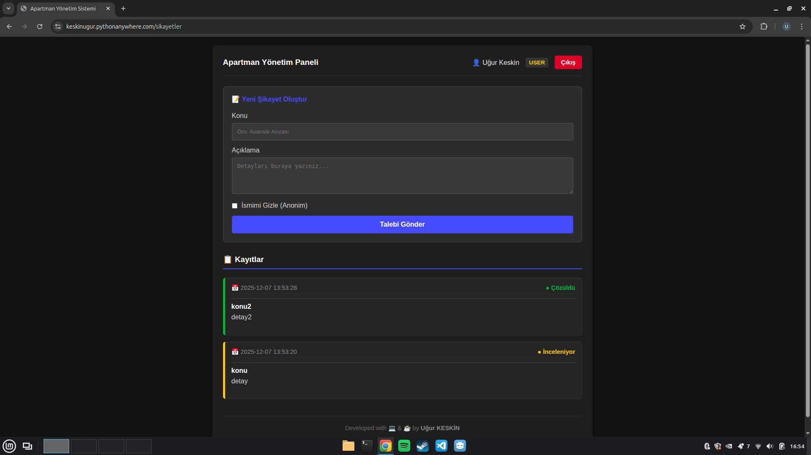
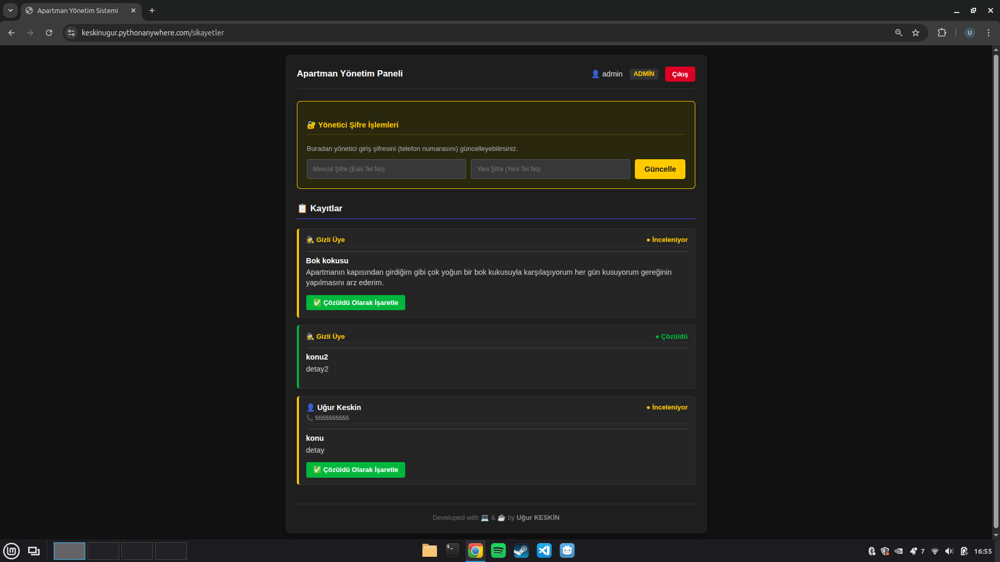

# 🏢 Apartman Yönetim Sistemi (Apartment Management System)


Yönetim Bilişim Sistemleri (MIS) **Sistem Analizi ve Tasarımı** dersi kapsamında geliştirilmiş, apartman/site sakinlerinin şikayetlerini iletebildiği ve yöneticinin bu talepleri takip edebildiği web tabanlı yönetim sistemidir.

## 🎯 Özellikler

* **Rol Tabanlı Giriş:** Yönetici ve Kullanıcı (Sakin) için ayrıştırılmış paneller.
* **Şikayet Yönetimi:** Sakinler anonim veya isimli şikayet oluşturabilir.
* **Admin Paneli:** Yönetici şikayetleri görüntüleyebilir, kullanıcı bilgilerine erişebilir ve sorunları "Çözüldü" olarak işaretleyebilir.
* **Güvenli Oturum:** Flask Session yönetimi ve yetkilendirme kontrolleri (Admin paneline IDOR koruması).
* **Responsive Tasarım:** Karanlık mod (Dark Mode) uyumlu modern arayüz.
* **Database Workaround:** Prototip aşamasında kolaylık olması açısından, yönetici şifresi veritabanında telefon numarası sütununda tutulmaktadır.

## 🛠️ Teknolojiler

* **Backend:** Python, Flask
* **Veritabanı:** SQLite3
* **Frontend:** HTML5, CSS3, Jinja2 Template Engine

## 🚀 Kurulum (Installation)

Projeyi yerel makinenizde çalıştırmak için adımları takip edin:

1.  **Projeyi Klonlayın:**
    ```bash
    git clone [https://github.com/keskin-ugur/apartman-yonetim-sistemi.git](https://github.com/keskin-ugur/apartman-yonetim-sistemi.git)
    cd apartman-yonetim-sistemi
    ```

2.  **Gerekli Kütüphaneleri Yükleyin:**
    ```bash
    pip install -r requirements.txt
    ```

3.  **Uygulamayı Başlatın:**
    ```bash
    python app.py
    ```

4.  **Tarayıcıda Açın:**
    `http://127.0.0.1:5000` adresine gidin.

## 🔑 Kullanım Bilgileri

Sistem ilk kez çalıştırıldığında veritabanını (`apartman.db`) otomatik oluşturur ve varsayılan yöneticiyi ekler.

### Yönetici Girişi (Default Admin)
* **İsim Soyisim (veya Kullanıcı Adı):** `admin`
* **Telefon Numarası (Şifre Yerine):** `12345`

### Normal Kullanıcı
* Kayıt olmak için giriş ekranında İsim Soyisim ve Telefon Numarası girmeniz yeterlidir. Sistem numarayı otomatik kaydeder.

## 📷 Ekran Görüntüleri

| Giriş Ekranı | Admin Paneli |
|:---:|:---:|
|  |  |  |

*(Not: Ekran görüntüleri klasörü proje içerisindedir)*

## ⚠️ Güvenlik Notu (Disclaimer)

Bu proje eğitim amaçlı bir prototiptir (MVP). 
* Şifreler veritabanında **plain-text (düz metin)** olarak saklanmaktadır.
* Gerçek dünyada (Production) kullanım için şifrelerin Hash'lenmesi (SHA-256/Bcrypt) ve veritabanı yapısının normalize edilmesi önerilir.

## 👨‍💻 Geliştirici

Developed with 💻, ☕ & 🤖 by **[Uğur KESKİN](https://github.com/keskin-ugur)**

---
*License: MIT*
